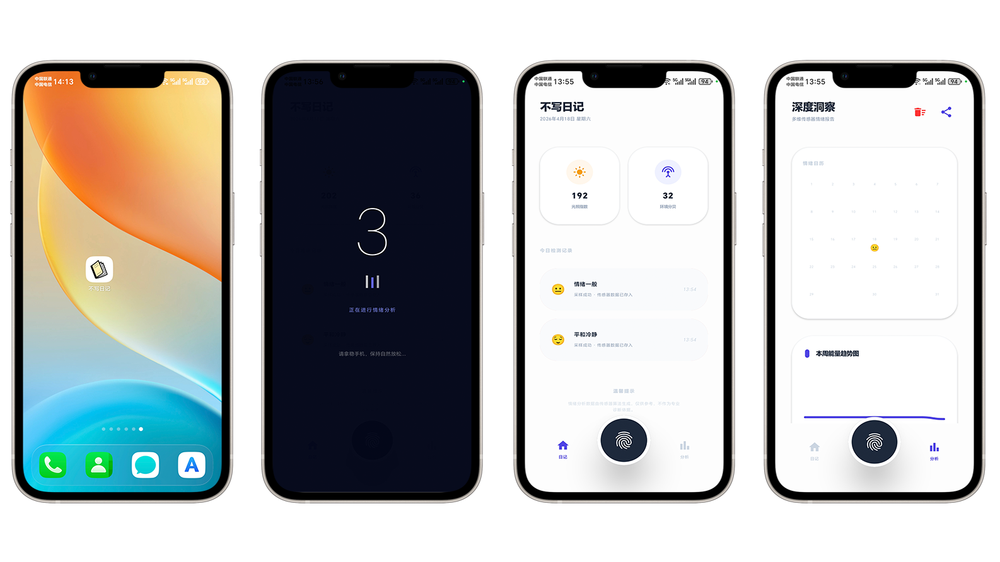
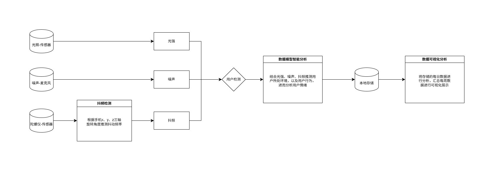

# 传感器情绪日记

一款基于 Android 的多模态情绪记录应用，通过融合手机传感器数据与云端语音识别，实现智能化的情绪检测与分析。

<div align="center">
  
</div>

## 设计思路

<div align="center">
  
</div>

## 核心功能

### 多模态情绪检测

长按底部指纹按钮，启动情绪分析流程：

- **光照传感器** — 实时采集环境光照强度 (Lux)
- **加速度计** — 检测设备抖动频率与用户活动状态（静止 / 微动 / 走动）
- **陀螺仪** — 辅助检测手机稳定性
- **麦克风** — 采集环境分贝 (dB)、语音基频 (Hz)、语调分析（平稳 / 起伏 / 紧张）
- **云端语音识别** — 录音上传后识别文本内容，进行情感关键词分析

### 评分算法

采用 **文本一票否决制**：

| 文本情感 | 基础分 | 传感器微调范围 | 最终范围 |
|---------|-------|-------------|---------|
| 强正面 | 80% | ±15% | 65% ~ 95% |
| 强负面 | 20% | ±15% | 5% ~ 35% |
| 中性/无语音 | 环境加权 | — | 35% ~ 65% |

中性模式下使用线性加权：光照 30% + 稳定性 30% + 安静度 25% + 活动状态 15%。

### 情绪记录与管理

- 检测结果确认后存入本地数据库
- 单条记录支持左滑删除，带确认对话框
- 分析页支持一键清理所有本地数据
- 所有数据仅存于设备本地，保护隐私

### 数据分析与可视化

- **能量趋势图** — 自定义 Canvas 绘制 7 日能量面积曲线
- **情绪日历** — 月度 emoji 网格展示每日情绪状态
- **快捷统计** — 本周记录数、平均能量、最佳状态
- **周报分享** — 生成情绪周报海报，支持复制文字总结

### 可交互 Mascot 角色

- 屏幕右侧边缘爬行的角色，支持点击互动
- 多种表情状态（开心、大笑、害羞、生气、困倦、惊讶）
- 自动状态机：爬行 → 暂停 → 空闲（哈欠/挠头/环顾）→ 随机跳跃
- 眨眼、挤压拉伸、肢体摆动等动画

## 项目结构

```
app/src/main/java/com/example/sensordiary/
├── MainActivity.kt                  # 入口 Activity，Compose 布局组装
├── data/
│   ├── AppDatabase.kt               # Room 数据库配置 (v4，含迁移脚本)
│   └── MoodDao.kt                   # 数据访问层 (Flow 响应式)
├── model/
│   └── MoodRecord.kt                # 情绪记录实体 + 情绪选项数据类
├── ui/
│   ├── components/
│   │   ├── BottomNavBar.kt          # 底部导航栏 + 指纹扫描按钮 + 脉冲动画
│   │   ├── ExportModal.kt           # 情绪周报海报 + 文字总结复制
│   │   ├── MascotCharacter.kt       # 可交互角色 (状态机 + 多表情 + 动画)
│   │   ├── ResultModal.kt           # 检测结果弹窗 (能量条 + 语音分析 + 传感器数据)
│   │   └── ScanLayer.kt             # 扫描动画层 (倒计时脉冲 + 信号条)
│   ├── screens/
│   │   ├── HomeScreen.kt            # 首页 (传感器网格 + 记录列表 + 左滑删除)
│   │   └── AnalysisScreen.kt        # 分析页 (趋势图 + 日历网格 + 快捷统计)
│   └── theme/
│       ├── Color.kt                 # 自定义颜色常量
│       └── Theme.kt                 # Material 3 主题配置
└── util/
    └── SensorHelper.kt              # 传感器管理 (光/加速度/陀螺仪/音频 + 自相关基频检测 + A 计权)
```

```
design/
└── design.html                      # 高保真交互原型
```

```
image/
├── effect.png                       # 应用真机效果图
└── theory.png                       # 设计思路流程图
```

## 技术栈

- **开发语言**：Kotlin
- **UI 框架**：Jetpack Compose
- **数据库**：Room (本地持久化)
- **架构模式**：MVVM + ViewModel + Coroutines + Flow
- **网络请求**：OkHttp
- **设计规范**：Material 3
